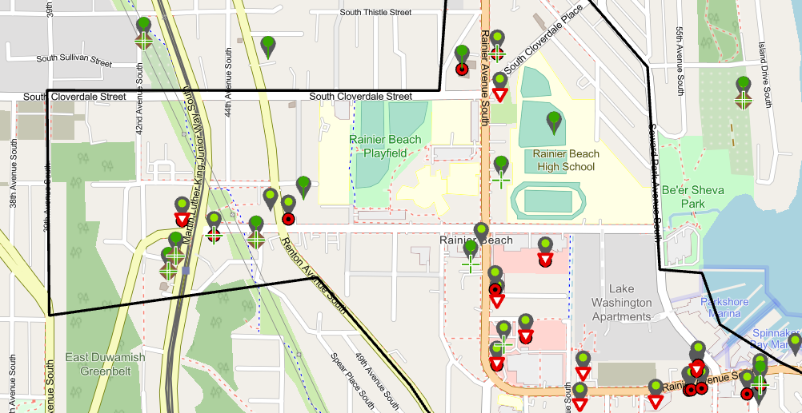

# Building the Rainier Beach Food Justice map

## Introduction
The [Rainier Beach Action Coaltion](https://www.rbcoalition.org/) (RBAC) manages a variety of community development programs in South Seattle. 
Food justice is one of their prioirities for improving quality of life for local residents. Food justice relates to residents in lower income, 
or underserved neighborhoods, having access to a variety of affordable and healthy food choices. 
Too often, residents in these communities can choose only from a short list of fast food restaurants,
or convenience stores with a limited selection of fresh produce. 
Better alternatives, such as commmunity gardens and urban farms are not as well known. 
Rainier Beach is also home to many small businesses, many immigrant owned. 
These restaurants and food trucks are not easily found on the internet. 
To help get the word out about the many health food choices available in the community, 
Stew Bowerman, a program coordinator at RBAC, approached me with an idea to show the variety of food justice related locations in and around Ranier Beach on a map. 

## Sourcing data
In any data project, getting the right data is essential. 
Sourcing small business data is especially challenging. 
Fortunately, one of my former clients [Opportini, LLC](https://www.opportini.com), specializes in business data and agreed to share what they knew about local businesses. 
This data provided a great starting point, as it contained most every established business in the area. 
Missing were many of the local, under-the-radar, food establishments, such as food trucks and community gardens. 
This is where RBAC provided invaluable assistance.  
Stew enlisted local volunteers to identify the many non-traditional food locations. 
With this help, I was able to build a comprehense data set of all food related locations in South Seattle.
  

## Data transformations and geocoding 
This project highlights a number of challenges which are common in this field.

1. **Data integration**  
While the data supplied by Opportini arrived well structured, the format of data supplied by RBAC was less consistent. 
Combining data from these different sources expanded the amount of necessary ETL work needed.  
    -  **Identifying food busineses:**  
        The original data set contained over 200k business in Washington state. 
        Knowing that we would be relying on volunteers to manually verify the locations, slimming down this list was essential. 
        First, we identified all businesses in two zip codes of interest (98118, 98178).
        Then we evaluated the business type categories provided on the source data to find the food businesses.
        The challenge here was that each business could be assigned up to five types, among 400 unique labels. 
        After working with the client to determine which categories they wanted to include as food locations, e.g. Caterers, Smokehouse, 
        I evaluated all five categories to determine if any of food categories were present. 
        If any of the fields contained a food business category, the location was included in our assessment.  

        Once completed, it was straighforward to select those businesses in our two zip codes which were categorized as food businesess 
        and export a file for use by the local volunteers.  
        
    - **Volunteer Survey:**  
        After the initial list of food locations was identified, Stew handed off the list to the volunters at the Rainier Beach Action Coalition. 
        They added many local spots not on the original list of traditional food establishments, including community gardens and urban farms.
        Most important, since we were mapping local spots for a local audience, 
        they added their on-the-ground knowledge of what spots they considered healthy choices and which ones to avoid. 
        They also provided otherwise unavailable data on which food spots are owned by Black or Indigenous People of Color (BIPOC).

    -  **Address cleaning:**  
        While this map would not be possible with the local volunteer contribution,
        maintaining consistent data gathering techniques across so many people proved challenging. 
        One area where this showed up was in addresses, in particular address abbreviations. 

        Martin Luther King Jr. Way South and Rainier Ave South are main thoroughfares in Rainier Beach.
        Reviewing the data, I observed several variations in these street names.
        Consistency of street names wasn't just important for providing a polished finished product. 
        Having so many "incorrect" spelling variations degraded the geocoding results. 
        For this reason, address cleaning became an ETL priority. 

        I accomplished this by defining a function called `clean_address`. 
        This function also identifies addressed which create an error. 

                def clean_address(addy):
                    
                    addyErr = False
                    
                    cleanAddy = addy
                    
                    # Clean addresses, except when error, return origional address
                    
                    try: 
                        cleanAddy = cleanAddy.replace('MLK', 'Martin Luther King')
                        cleanAddy = cleanAddy.replace('Mlk', 'Martin Luther King Jr Way S')
                        cleanAddy = cleanAddy.replace('\n', ', ')
                        cleanAddy = cleanAddy.replace('SSeattle', 'S, Seattle')
                        cleanAddy = cleanAddy.replace('StSeattle', 'St, Seattle')
                        cleanAddy = cleanAddy.replace('Rainer', 'Rainier')
                        
                    except:
                        addyErr = True   # Identify error producing address
                        
                        return addyErr, addy
                    
                    return addyErr, cleanAddy

    -  **Food justice cateogry encoding:**  
        The last data cleaning task was standardizng food category encoding. 
        In most cases, the volunteers had simply marked a location as belonging to a category with an 'x' in the appropriate column. 
        Otherwise, it was left blank. 
        This would satisfy most casual users, but I wanted to improve data consistency and reduce the chance for errors from `Null` values. 
        To do this, I iterated through each row, replacing the x's with 'Yes' and filling in the blanks with 'No'.

1. **Forward geocoding**  
    After cleaning the addresses and applying a standard format, the next step was to obtain latitude and longitude for each location. 
    I chose to use [LocationIQ](https://www.locationiq.com/) because I was familiar with the geocoding service from a previous project. 
    It is also easy to use, provides good documentation, and offers a free tier, which was satisfactory for this project. 

    - **Signup and access tokens**  
        Signing up for LocationIQ was straightforward. 
        And obtaining the access token was no problem. 
        The only place I hit a bump was some initial confusion on whether to restric my token. 
        It wasn't clear to me that restricting the access token to certain HTTP referrers or IP addresses was optional. 
        The upside of this confusion was my experiencing great customer service. 
        My emails were answered promptly and we quickly resolved the access error. 

    - **Geocoding API**  
        The LocationIq API is [well documented](https://locationiq.com/docs). 
        It requires just two parameters to be passed in JSON format, your API key and the address string. 
        The address can be a provided as a single string or split into components.  
        
        I found that splitting the addresss into its components improved search accuracy. 
        To simplify this I created a dictionary called *splitAddy_keyMap*. 
        This dictionary mapped the LocationIQ split address field names (keys) to my address data field names (values).

            splitAddy_keyMap = {'street' : 'StreetAddress',
                        'city' : 'City',
                        'state' : 'State',
                        'postalcode' : 'Zip'
                        }

        It provided an easy way to package my address data in the format needed for the LocationIQ API. 
        Before calling the API, I called a function, passing this dictionary and a dataframe row. 
        I kept the original keys (needed for the LocationIQ API) and used the original values as index values for the dataframe row, 
        to return a new dictionary with the actual address to be searched as values. 

                def get_SplitAddy (splitAddy_keyMap, addyRow):
                    
                    splitAddy_keys = list(splitAddy_keyMap.keys())
                    splitAddy_idx = list(splitAddy_keyMap.values())
                    splitAddy_vals = []
                    
                    for idxval in splitAddy_idx:
                        splitAddy_vals.append(addyRow[idxval])
                        
                    splitAddy_dict = dict(zip(splitAddy_keys, splitAddy_vals))
                    
                    return splitAddy_dict

        The other simple technique that improved search accuracy was limiting API searches to a specific geography. 
        Again, LocationIQ made this easy with its *viewbox* and *bounded* API options. 
        All I needed to do was include two opposite corner points in lat/long format and set bounded to True(1) to define the search area limits. 
        This resolved two particularly challenging addresses with "pre-directionals" that were initially matched to similar addressses,
        e.g. "South 113th St" and "Southeast 113th St"  
        
## ArcPro GIS development
Once I had retrived lat/long for all the location, it was time to export the data for use with ArcGIS Pro. 
While this program provides the tools to produce sophisticated maps, it not as intuiative as I had hoped. 
Fortunately, ESRI provides helpful documentation. 
After some old fashioned OJT I was able to produce a map that met mine and my clients expectations. 
A few challenges required upstream data transformations. 
The most challenging of these was driven by a limitation in the browsing experience. 
Filter Views is a feature of ArcGIS Pro that allows the user to create different map layers from a single data table.
The locations that are presented in a layer are identified using a SQL query, e.g. where a certain value is True. 
When I first loaded the output into ArcPro, I was able to create a view for each of food justice categories. 
However, these differences were not available in the web map I shared with my client. 
To work around this limitation, I chose to export the locations of each category as a separate table. 
This created some repetitive tasks when creating different drafts of the map, but I was able to achieve the desired results. 

Visit this link to view the live [Rainier Beach Food Justice map](https://freeheel.maps.arcgis.com/apps/mapviewer/index.html?webmap=d956a57235b749d2a623b0f0e38b05a4).

## Next steps
I'm looking forward to working with the Rainier Beach Action Committee to enhance this map, 
or potentially on other data related projets to support their community development efforts. 

Personally, I'm working on more challenging data science projets, 
mostly where I can combine my passion for Python with GIS. 
IoT is also another area where all these skills combine for very interesting projects. 

## Acknowledgements
I'd like to thank Stew Bowerman at the Rainier Beach Action Coalition for his guidance, enthusiasm, and patience; 
all the RBAC volunteers; 
and Jonny Martin, at Opportini.com for supplying essential data and his enthusiastic support.  
 

